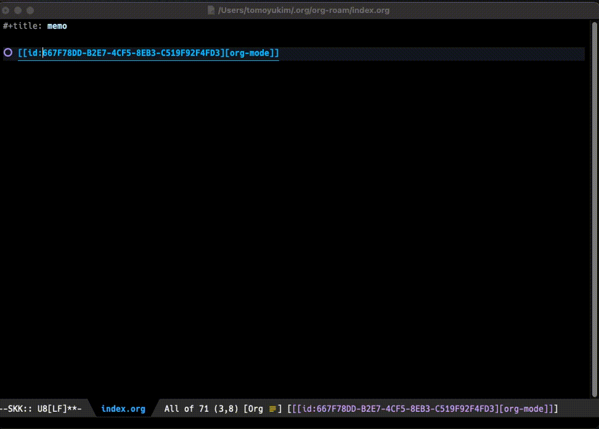

# org-roam-linktip

`org-roam-linktip` is an extension of [org-roam](https://github.com/org-roam/org-roam).
This package provides a function to show linked contents instantly on the posframe without jumping to the contents.



## Installation

### Using `straight.el`

```elisp
(straight-use-package
 '(org-roam-linktip :type git :host github :repo "tomoyukim/org-roam-linktip"))
```

Or with `use-package`

```elisp
(use-package
  :straight (org-roam-linktip :type git :host github :repo "tomoyukim/org-roam-linktip")
```

## Configuration
```elisp
(use-package
  :straight (org-roam-linktip :type git :host github :repo "tomoyukim/org-roam-linktip")
  :custom
  (org-roam-linktip-background-color "gray80")
  (org-roam-linktip-border-width 2)
  (org-roam-linktip-border-color "gray30")
  :hook
  (org-mode-hook . org-roam-linktip-mode))

```
